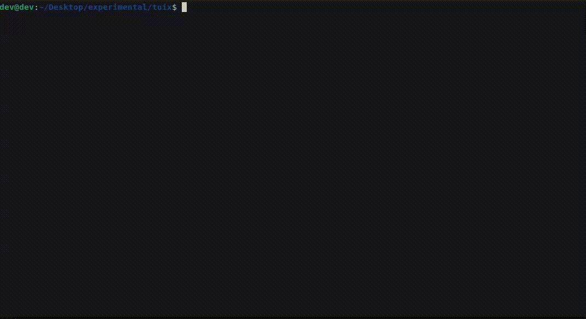

# tuix

A Go framework for building interactive terminal UIs with React-style components and hooks.

Tuix brings the declarative, composable model of React — functional components, `UseState`, `UseEffect`, `UseContext`, flexbox layout — to the terminal. You describe _what_ your UI looks like; tuix handles measuring, laying out, rendering, and diffing only the cells that changed.

> 📖 **Full documentation:** [DOCS.md](DOCS.md) — every feature, runnable examples, deep dives.
> 🚀 **Try it now:** `go run ./examples/hello` (or any of [11 other examples](examples/)).

---


## Features

- **Functional components** — plain Go functions that return an `Element` tree
- **Hooks** — [`UseState`](DOCS.md#usestate), [`UseEffect`](DOCS.md#useeffect), and [`UseContext`](DOCS.md#usecontext)
- **Flexbox [layout engine](DOCS.md#layout)** — two-pass (measure → layout) with `Row`/`Column` direction, `Gap`, `Padding`, `Align`, `Justify`, and `Fixed`/`Grow`/`Fit` sizing
- **Rich [styling](DOCS.md#styling)** — ANSI16, ANSI256, and RGB/Hex colors; bold, italic, underline; four border presets
- **Bracketed paste** — multi-line clipboard content arrives as a single `KeyPaste` event
- **Built-in [component library](DOCS.md#component-library)** — Table, Tabs, Modal, Input, Button, Checkbox, List, SelectPicker, Spinner, ProgressBar, Alert, Badge, Panel
- **Efficient rendering** — cell-level diffing; only changed cells are written to the terminal
- **Full Unicode support** — proper character-width handling via `go-runewidth`

---

## Installation

```bash
go get github.com/subhasundardass/tuix
```

Requires Go 1.21+.

---

## Quick Start

```go
package main

import (
    "fmt"

    "github.com/subhasundardass/tuix/tuix"
)

func App(props tuix.Props) tuix.Element {
    count, setCount := tuix.UseState(0)

    if tuix.CurrentKey.Code == tuix.KeyEnter {
        setCount(count + 1)
    }

    label := tuix.NewStyle().Bold(true).Foreground(tuix.Cyan)

    return tuix.Box(
        tuix.Props{Direction: tuix.Column, Gap: 1, Padding: [4]int{1, 2, 1, 2}},
        tuix.NewStyle(),
        tuix.Text("Press Enter to count, Ctrl-C to quit", tuix.NewStyle()),
        tuix.Text(fmt.Sprintf("Count: %d", count), label),
    )
}

func main() {
    app := tuix.NewApp(60, 6)
    app.Run(App, tuix.Props{})
}
```

Run it:

```bash
go run .
```

Press **Ctrl-C** to exit (there is no `Exit()` function).

---

## Examples

| Example                                   | Demonstrates                      |
| ----------------------------------------- | --------------------------------- |
| [`hello`](examples/hello/)                | minimal program                   |
| [`counter`](examples/counter/)            | `UseState` + keyboard             |
| [`styling`](examples/styling/)            | colors, borders, text styles      |
| [`layout`](examples/layout/)              | flexbox: direction/sizing/justify |
| [`input`](examples/input/)                | `Input` component + paste         |
| [`list`](examples/list/)                  | navigable `List`                  |
| [`table`](examples/table/)                | `Table` with `onChange`           |
| [`tabs`](examples/tabs/)                  | `Tabs` switching content panels   |
| [`modal`](examples/modal/)                | `Modal` open/close                |
| [`overlaymodal`](examples/overlay-modal/) | `OverlayModal` open/close         |
| [`tree`](examples/tree/)                  | `Tree` collapse/expand            |
| [`effect-clock`](examples/effect-clock/)  | `UseEffect` + goroutine cleanup   |
| [`context`](examples/context/)            | `Context` + `Provide` thunk       |
| [`conditional`](examples/conditional/)    | `If` helper                       |

```bash
go run ./examples/<name>
```

---

## Learn more

Everything beyond the quick start lives in **[DOCS.md](DOCS.md)**:

- [Quick start](DOCS.md#quick-start) · [Mental model](DOCS.md#mental-model)
- [Text](DOCS.md#text) · [Box](DOCS.md#box) · [Styling](DOCS.md#styling) · [Borders](DOCS.md#borders)
- [Layout: direction, gap, padding, sizing, justify/align](DOCS.md#layout)
- [Hooks: UseState, UseEffect, UseContext](DOCS.md#hooks)
- [Keyboard input + bracketed paste](DOCS.md#keyboard-input)
- [Component library: Badge, Alert, Spinner, ProgressBar, Panel, Button, Input, Checkbox, List, SelectPicker, Table, Tabs, Modal](DOCS.md#component-library)
- [Advanced: conditional rendering, context internals, the two-pass render](DOCS.md#advanced)
- [Recipes: focus cycling, polling, toast notifications](DOCS.md#recipes)
- [API reference index](DOCS.md#api-reference-index)

---

## Architecture

```
keyboard / ticker
       │
       ▼
   runtime.go          ← event loop, re-render scheduling
       │
       ▼
 component tree         ← functional components + hooks
       │
       ▼
  layout engine         ← 2-pass flexbox (measure → layout)
       │
       ▼
   renderer.go          ← element tree → screen cells
       │
       ▼
    screen.go           ← cell diffing → ANSI output → terminal
```

**Hooks cursor pattern:** State is identified by call order within a render, not by name. This is why hooks must never be called conditionally — the nth `UseState` call always corresponds to the same state slot.

**Two-pass layout:**

1. _Measure_ — bottom-up: each node reports its intrinsic size.
2. _Layout_ — top-down: parent distributes space and assigns a concrete `Rect` to each child.

**Two-pass render:** Each event triggers the component tree to run twice — once with `CurrentKey` set (so handlers fire), once with it zeroed (so paint reflects the post-handler state). See [DOCS.md#the-two-pass-render](DOCS.md#the-two-pass-render) for the gotcha this creates.

---

## Contributing

Contributions are welcome. Please follow these guidelines to keep the codebase consistent.

### Getting Started

```bash
git clone https://github.com/subhasundardass/tuix
cd tuix
go mod download
go test ./...
```

### Workflow

1. **Open an issue first** for non-trivial changes to align on the approach before writing code.
2. **Branch off `main`:** `git checkout -b feat/my-feature`
3. **Keep commits focused** — one logical change per commit with a clear message.
4. **Add tests** for new layout or rendering behaviour in `*_test.go` files.
5. **Run tests and vet before opening a PR:**
   ```bash
   go test ./...
   go vet ./...
   ```
6. **Open a pull request** against `main` with a description of what changed and why.

### Code Style

- Follow standard Go conventions (`gofmt`, `golint`)
- Keep component functions pure where possible; side effects belong in `UseEffect`
- New built-in components go in `tuix/components/` — simple/display in `components.go`, interactive in `interactive.go`, compound in `complex.go`
- Avoid adding dependencies; the stdlib + the two existing deps cover most needs

### Adding a Component

1. Write the component function in the appropriate file under `tuix/components/`.
2. Use plain typed parameters where possible; reserve `props.Values` for genuinely dynamic data.
3. Add a runnable demo under `examples/<your-feature>/main.go`.
4. Document signature, keyboard contract, and a snippet in [`DOCS.md`](DOCS.md) under the relevant section.

### Reporting Bugs

Open a GitHub issue with:

- Go version (`go version`)
- Terminal emulator and OS
- Minimal reproduction case
- What you expected vs. what happened

---

## License

MIT — see [LICENSE](LICENSE).
